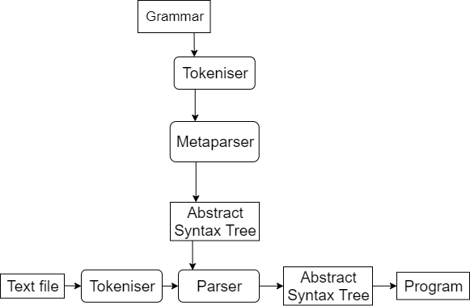

# Peguin 

A general purpose PEG (Parsing Expression Grammar) parser generator, which I wrote so I could generate an "infinite-lookahead" parser for [railway](https://github.com/jndean/railway) code to replace the old LR(1) one. The main program, _parsergenerator.py_, takes any grammar file (files with the .peg extension in this repository) and produces python code which can parse files that adhere to the described grammar rules. It takes a lot from the [blog posts](https://medium.com/@gvanrossum_83706/peg-parsers-7ed72462f97c) on PEG parsers by Guido van Rossum.

As an example, the rule defining how to parse railway if statements in one of these grammars looks like this:

```peg
if_stmt : 'if' '(' expression ')' NEWLINE
              statement*
          ('else' NEWLINE
              statement* {t2} )?
          'fi' '(' expression? ')'
          { If(t2, t5, t6, t9) };
```

### Usage

```bash
$ python3.8 parsergenerator.py \
                -i grammarfile.peg \
                -o parser.py
```

### Partially self-hosting?

So here I am writing my programming language, and I need to write the bit that parses the source code files. The files are just text; flat streams of characters, so I write a simple tokeniser that turns them into streams of tokens (i.e. groups characters up into words, removes whitespace and comments, marks language keywords etc). Then I need a **parser**, something that understands the grammar of the language and turns the flat stream of tokens into a structured object, in this case an abstract syntax tree. It builds the tree out of nodes corresponding to things like if statements, for loops, function declarations etc, each of which has a method for compiling itself and the results of its sub-nodes into executable objets. Then I can ask the root of the tree to compile itself, and I get back the final program, ready to be executed, and hopefully it will behave exactly how the writer of the input text file expects.


Peguin is a **parser generator**; it writes the parser for you (it writes a python file).


Of course, you need to tell be able to define the grammar that you want the generated parser to parse, so you must write a grammar file and give it to Peguin as input. Peguin must be able to parse these grammar files and produce a program, which means it follows exactly the same sequence of parsing and compiling steps I described above, except that this time I write the nodes of the abstract syntax tree to compile down to source code (literal text rather than in-memory objects that are ready to execute). So it will write the source code of the final parser for us. 



So the vertical line is what's contained in this repository. However, since it is just the same as the horizontal line, it makes complete sense to write a grammar file that describes the grammar of grammar files (the metagrammar) and have Peguin generate the source code for its own parser (called the metaparser).


That would be fine, except the process of generating the metaparser requires use of said metaparser before it has been generated. To overcome this, we write the metagrammar in a grammar file that __uses__ only the most simple grammar features (no using operators like Repeat, Optional, Join, Greedy), but still __describes__ a fully featured metaparser. Then we hand-code a bootstrap metaparser to use the first time the metagrammar is parsed.


This produces a fully featured metaparser which replaces the bootstrap, and is capable of parsing and generating itself as well as all other (legal) grammars. Hence my claim that Peguin is partially self-hosted. It is a parser generator, so it can generate its own parser, but that's not the same as saying it can completely generate itself. We still have to write the tokeniser and the nodes that make up the abstract syntax tree.


### Join and Greedy?

Most of the operators available for writing grammars will be familiar from other places, for example the two Repeat operators ( __*__ and __+__) , the Optional operator (__?__) and the Or operator (__|__). I did make up some new ones, Join and Greedy, which made my life easier in the railway parser generator but might be a bit superficial. 

The Join operator (__^__) is a binary operator which generates a rule to match lists, whose elements match the left hand argument and are separated by the tokens matching the right hand argument. The list may be empty, so a join rule will always match. For example, to parse a comma-separated tuple of expressions you can write this rule:

```PEG
tuple : '(' expression ^ ',' ')' {t1};
```

rather than some rule using the Repeat and Or operators such as:

```PEG
tuple : '(' expression (',' expression {t1})* ')' { [t1] + t2 }
      | '(' ')'                                   { []        };
```

The Greedy operator (__$__) is another binary operator acting like an Or operator, except rather than short-circuiting after any option matches, it will try to parse all options and return the one which consumed the most tokens. I use it to generate parsing rules for the "call chains" in railway code, where calls are strung together by arrows but the arrows can go in either direction. Here are 3 examples of valid railway call chains.

```railway
call make_data() => call compress() => uncall decrypt(key)
uncall make_data() <= uncall compress() <= call decrypt(key)
call dothings(arg1, arg2)
```

The following rule does not parse all these chains correctly

```PEG
call_chain : call_block ^ '=>' | call_block ^ '<=' ;
```

because, if the chain uses left arrows like the second example, the right arrow part of the rule runs first, manages to parse a list of one call_blocks (before it hits the left arrow token and returns), and so the whole Or statement and hence the whole call_chain rule returns having consumed only the first call_block. With the greedy operator I can write the rule like this

```PEG
call_chain : (call_block ^ '=>') $ (call_block ^ '<=');
```

which ensures both versions are attempted and the one that consumes the most tokens is selected. The brackets are for clarity, they are not necessary due to the precedence of the operators.

### Docs

There are no docs. If you want a parser generator, PEG or otherwise, you should google a serious one, like [TatSu](https://github.com/neogeny/TatSu).